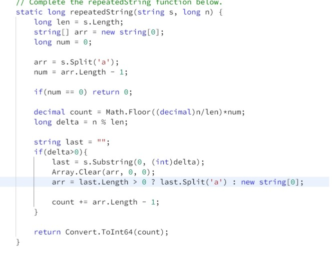
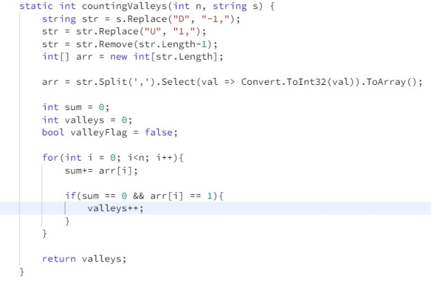
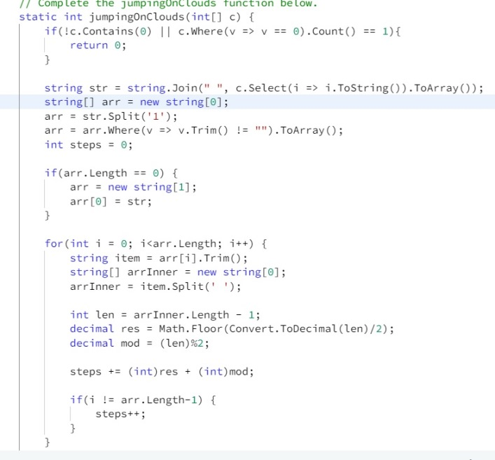
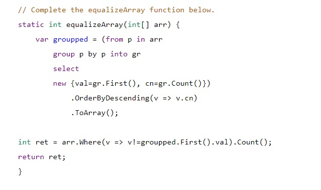
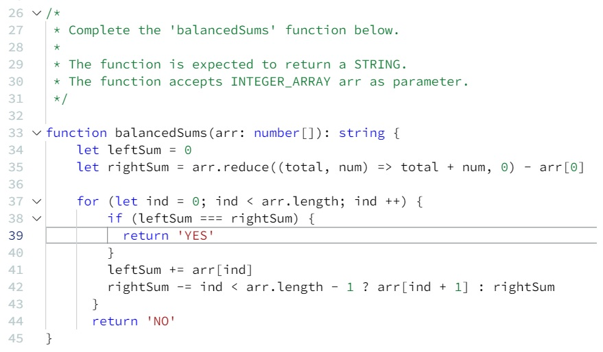
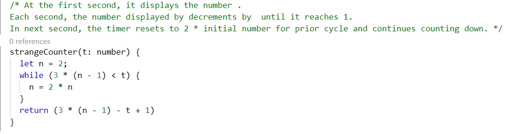
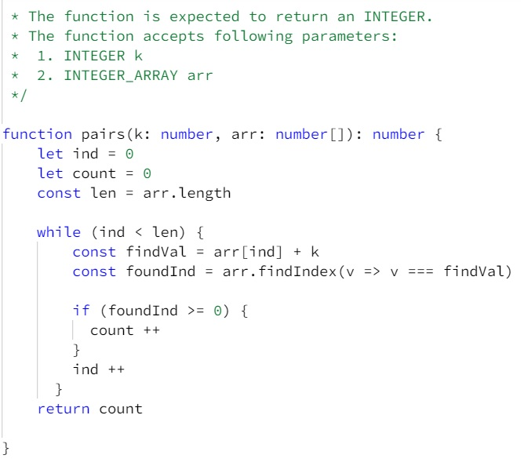

# HackerRank Practice Solutions

Some examples of problem solving during my practice on the [HackerRank](https://www.hackerrank.com) site.

### Repeated string:
Find the number of letter a's in the first *n* letters of infinite string.

### Counting portions: 
Calculate the number of downlevel portions in a path - sequence of consecutive steps of *n* steps string.
(*U* - uphill, *D* - downhill steps)

### Find the path:
Determine the minimum number of steps in *n* binary integers, *c*, to get from the starting postion to the last one.
*c* is Array of items numbered *0* if they are safe or *1* if they must be avoided.
Can step on any safe item having a number that is equal to the number of the current item plus *1* or *2*.

### Equalize the array:
Determine the minimum number of elements to delete in ann array of integers to get all remaining elements are equal.

### Find the number of squares on the chess board:
Given the start position on a square chess board and the locations of all the obstacles, find the number of squares that can be attacked from this start position.

The chess board's rows are numbered from *1* to *n*, going from bottom to top. Its columns are numbered from *1* to *n*, going from left to right. 
Each square is referenced by its location, *(r,c)* - row and column.
The attack can be done from *(r_q, c_q)* start position to any square in any of the eight directions (left, right, up, down, and the four diagonals).
- *n*: the number of rows and columns in the board
- *k*: the number of obstacles on the board
- *r_q*: the row number of the start position
- *c_q*: the column number of the start position.

[Count Steps](solutions/countSteps.cs)

### Sherlock and Array:
Find an element of the array such that the sum of all elements to the left is equal to the sum of all elements to the right.
Return string: either YES or NO

### Strange Counter:
At the first second, it displays the number.
Each second, the number displayed by decrements by *1* until it reaches *1*.
In next second, the timer resets to *2 X initial number for prior cycle* and continues counting down.
Return the value displayed at time *t*

### Pairs:
Given an array of integers and a target value, determine the number of pairs of array elements that have a difference equal to the target value.

